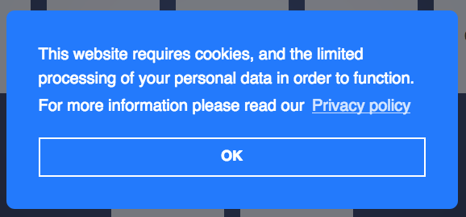
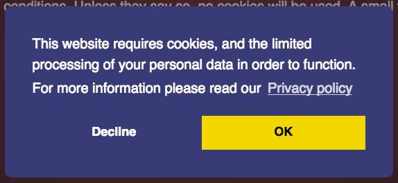
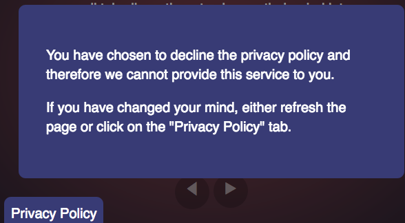

# Compliance

Both methods if the notice is accepted will set two cookies. One to confirm that the user has clicked on the accept/ok and the other stores the version of the privacy policy / terms and conditions. Both these are used to check that the user needs to see the notice or not.

### Informational

You tell your users that you use cookies and that you may process personal data, and that by continuing to use your website they understand how that data is used and that they have been informed. The user must click "ok" in order to continue.

This is the approach appears to be sufficient for anonymous browsing where consent is not needed.

This is also the easiest approach for website owners to implement, as it simply requires you add some code to your existing pages. It provides your users with no direct control over cookies, other than through their own browser settings.

### Opt-in

You tell your users that you wish to use cookies and will process the personal data, and give them one button to consent to the terms and conditions, and another to refuse them.

If the user declines, they will receive a notice saying that the service will be denied unless consent is given, and a "Privacy policy" tab appears so that the user can change their mind.

### Useful information

**We cannot guarantee an informational approach will be sufficient for your website. Please seek legal advice from a professional before using this library.**

To understand what you need for your site, the following link is really helpful:

[Guide to the General Data Protection Regulation (GDPR) @ ico.org.uk](https://ico.org.uk/for-organisations/guide-to-the-general-data-protection-regulation-gdpr/lawful-basis-for-processing)